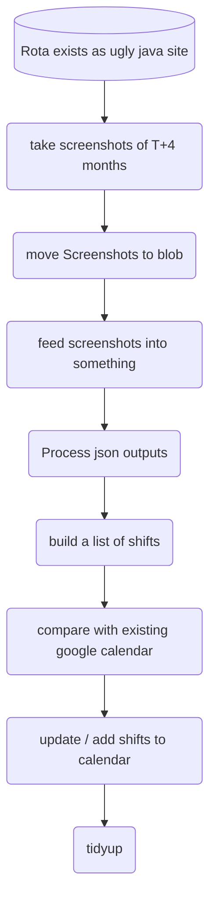

# Ocado Rota Grabber

Simple tool to work in azure, with several other components to extract rota information and get it into a google calendar.

## Overall

```mermaid
graph TB
A[(Rota exists as ugly java site)] --> B(take screenshots of T+4 months) --> C(move Screenshots to blob) --> D(feed screenshots into something) --> E(Process json outputs) --> F(build a list of shifts) --> G(compare with existing google calendar) --> H(update / add shifts to calendar) --> I(tidyup)
```

## Azure Specific

## Code Specific
